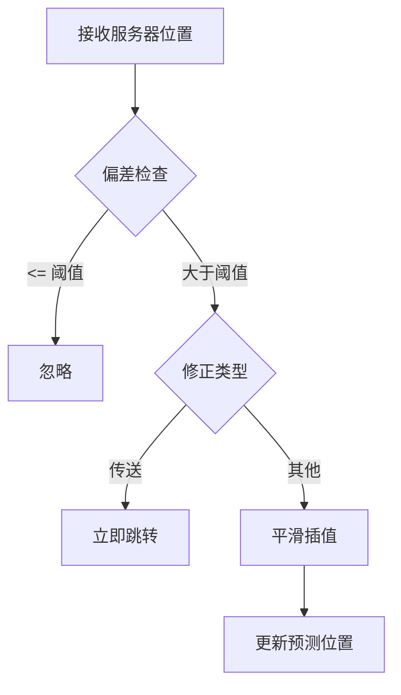
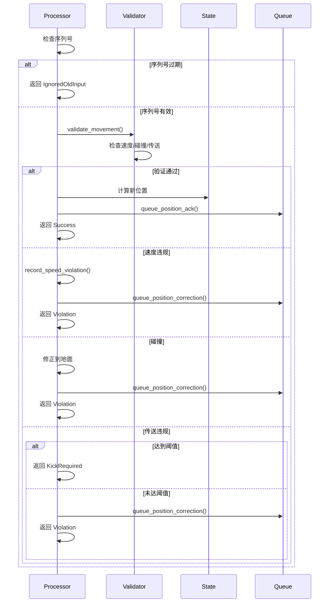
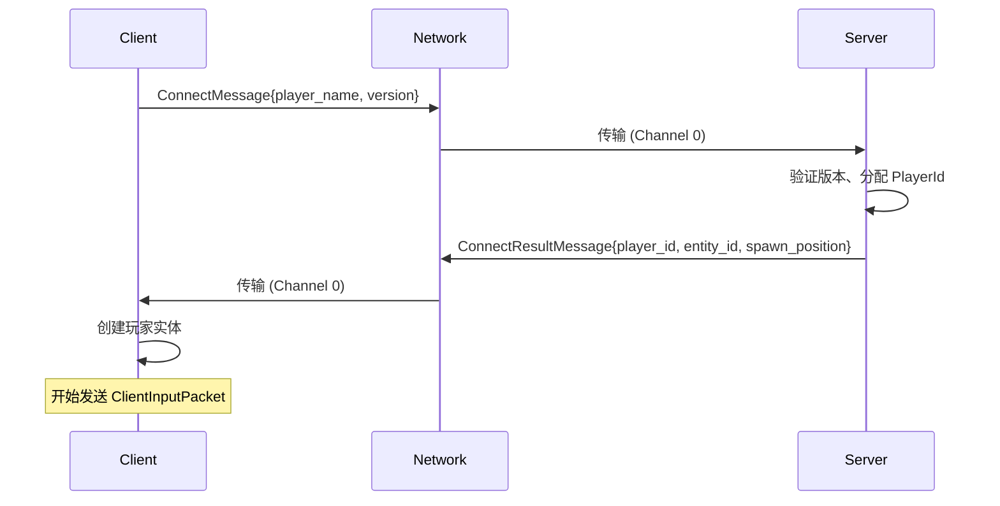
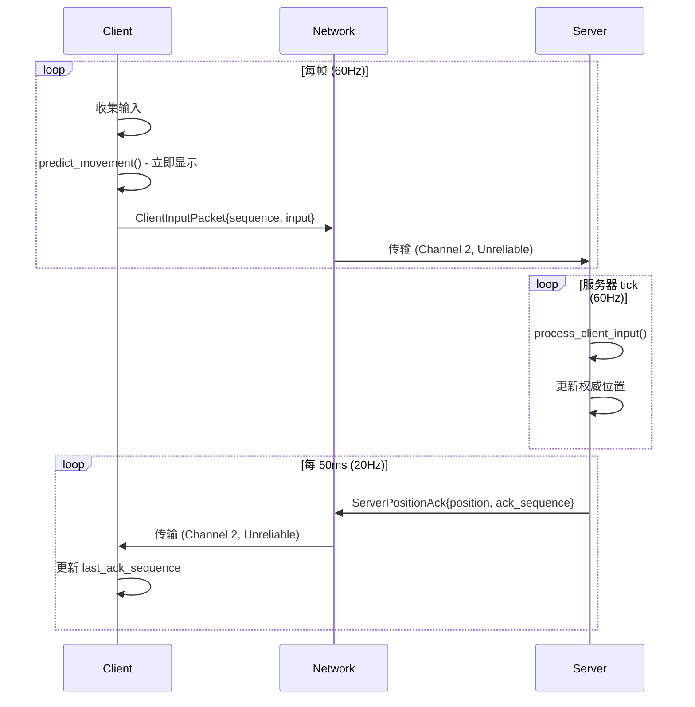
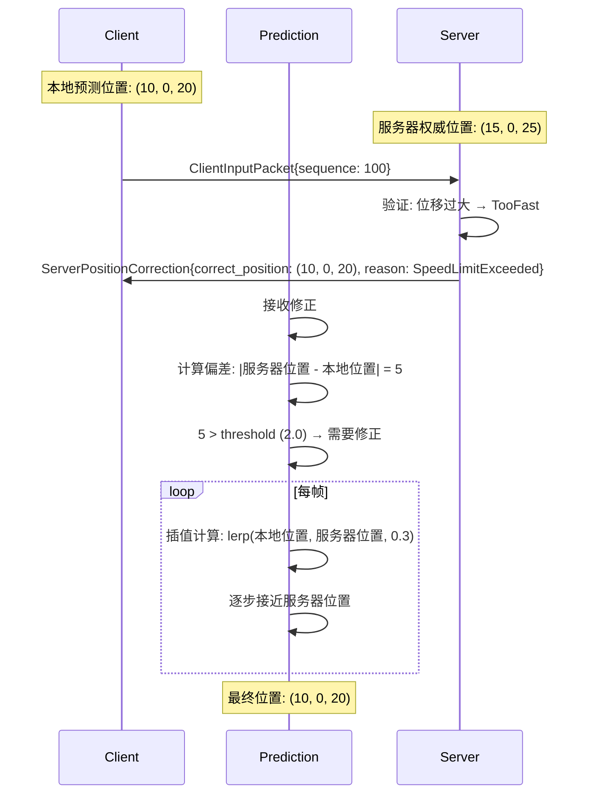
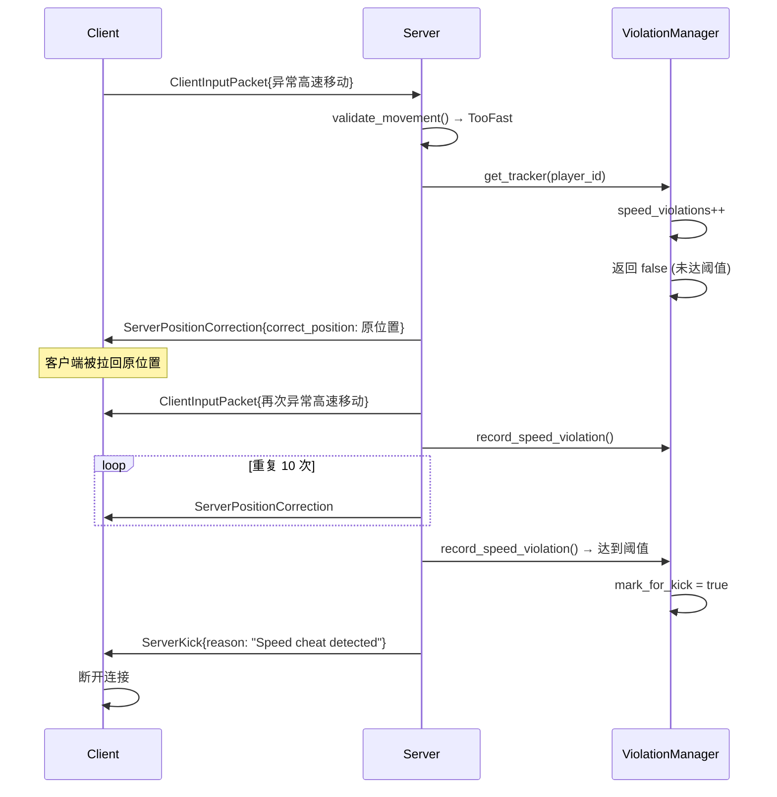

# 移动系统接口文档 | Movement System API Documentation

**项目**: TrueWorld 多人游戏
**版本**: 1.0
**日期**: 2026-03-02
**协议版本**: PROTOCOL_VERSION = 1

---

## 1. 协议概览 | Protocol Overview

### 1.1 通信模型 | Communication Model

```
┌─────────────────────────────────────────────────────────┐
│                    Network Layer                          │
├─────────────────────────────────────────────────────────┤
│  Channel 0 (ReliableOrdered)    │  Channel 1 (ReliableUnordered)  │
│  ┌──────────────────────────────┐  ┌──────────────────────┐        │
│  │ Position Correction (重要)    │  │ -                    │        │
│  │ ConnectResult (连接响应)      │  │                      │        │
│  └──────────────────────────────┘  └──────────────────────┘        │
│                                                               │
│  Channel 2 (Unreliable)                                         │
│  ┌──────────────────────────────────────────────────────┐    │
│  │ ClientInputPacket (60Hz) - 输入                     │    │
│  │ ServerPositionAck (20Hz) - 位置确认                  │    │
│  └──────────────────────────────────────────────────────┘    │
└─────────────────────────────────────────────────────────┘
```

### 1.2 消息类型 | Message Types

| 方向 | 数据包 | 通道 | 频率 | 大小 |
|------|--------|------|------|------|
| C→S | ClientInputPacket | 2 (Unreliable) | 60Hz | ~32+ bytes |
| S→C | ServerPositionAck | 2 (Unreliable) | 20Hz | ~44 bytes |
| S→C | ServerPositionCorrection | 0 (Reliable) | 按需 | ~21 bytes |
| C→S | ConnectMessage | 0 (Reliable) | 连接时 | 变长 |
| S→C | ConnectResultMessage | 0 (Reliable) | 连接时 | 变长 |

---

## 2. 数据包定义 | Packet Definitions

### 2.1 客户端数据包 | Client Packets

#### 2.1.1 ClientInputPacket

```rust
/// 客户端输入数据包 (60Hz, Unreliable Channel)
pub struct ClientInputPacket {
    /// 输入序列号 (u32)
    pub sequence: u32,

    /// 移动向量 [x, y, z] ([f32; 3])
    pub movement: [f32; 3],

    /// 动作列表 (Vec<InputAction>)
    pub actions: Vec<InputAction>,

    /// 客户端时间戳，用于延迟计算 (u64)
    pub timestamp: u64,
}
```

**字段说明** | Field Description

| 字段 | 说明 | 示例值 |
|------|------|--------|
| `sequence` | 递增序列号，服务器用于检测重复/乱序 | 0, 1, 2, ... |
| `movement` | 归一化的移动方向向量 | [0, 0, -1.0] = 前进 |
| `actions` | 当前活跃的动作列表 | `[MoveForward, Sprint]` |
| `timestamp` | Unix 时间戳（秒） | 1759481234 |

**动作枚举** | Action Enum

```rust
pub enum InputAction {
    // 移动类 | Movement
    MoveForward, MoveBackward, MoveLeft, MoveRight,
    Jump, Crouch, Sprint,

    // 战斗类 | Combat
    Attack, Block, Dodge,
    Skill1, Skill2, Skill3, Skill4,

    // 物品类 | Items
    UseItem, Interact,

    // UI类 | UI
    ToggleInventory, ToggleMap, ToggleMenu, Chat,
}
```

#### 2.1.2 ConnectMessage

```rust
/// 连接请求数据包
pub struct ConnectMessage {
    pub player_id: Option<PlayerId>,
    pub player_name: String,
    pub auth_token: Option<String>,
    pub version: String,
    pub room_id: Option<String>,
}
```

### 2.2 服务器数据包 | Server Packets

#### 2.2.1 ServerPositionAck

```rust
/// 服务器位置确认包 (20Hz, Unreliable Channel)
pub struct ServerPositionAck {
    /// 玩家 ID
    pub player_id: PlayerId,

    /// 最后确认的输入序列号
    pub ack_sequence: u32,

    /// 权威位置 [x, y, z]
    pub position: [f32; 3],

    /// 当前速度 [vx, vy, vz]
    pub velocity: [f32; 3],

    /// 服务器时间戳
    pub server_time: u64,
}
```

**字段说明** | Field Description

| 字段 | 说明 | 用途 |
|------|------|------|
| `ack_sequence` | 确认的序列号 | 客户端清理已确认的输入历史 |
| `position` | 服务器权威位置 | 客户端用于修正 |
| `velocity` | 服务器计算的速度 | 客户端用于插值 |

#### 2.2.2 ServerPositionCorrection

```rust
/// 位置修正包 (按需, Reliable Channel)
pub struct ServerPositionCorrection {
    /// 需要修正的玩家 ID
    pub player_id: PlayerId,

    /// 修正后的正确位置
    pub correct_position: [f32; 3],

    /// 修正原因
    pub reason: CorrectionReason,
}
```

**修正原因** | Correction Reason

```rust
pub enum CorrectionReason {
    /// 速度限制超限
    SpeedLimitExceeded,

    /// 碰撞检测（穿墙/地下）
    Collision,

    /// 服务器回滚（状态不一致）
    ServerRollback,

    /// 传送（游戏机制，非违规）
    Teleport,
}
```

#### 2.2.3 ConnectResultMessage

```rust
/// 连接响应数据包
pub struct ConnectResultMessage {
    pub success: bool,
    pub player_id: Option<PlayerId>,
    pub entity_id: Option<EntityId>,
    pub spawn_position: Option<[f32; 3]>,
    pub error: Option<String>,
    pub server_timestamp: u64,
}
```

---

## 3. 客户端 API | Client API

### 3.1 核心类型 | Core Types

```rust
// 客户端移动配置
pub struct MovementConfig {
    pub walk_speed: f32,      // 行走速度: 5.0
    pub run_speed: f32,       // 冲刺速度: 8.0
    pub jump_velocity: f32,   // 跳跃初速度: 5.0
    pub gravity: f32,         // 重力加速度: 20.0
    pub correction_threshold: f32,  // 修正阈值: 2.0
    pub correction_lerp: f32,  // 修正插值系数: 0.3
}

// 预测状态组件
#[derive(Component)]
pub struct PredictedState {
    pub position: Vec3,
    pub velocity: Vec3,
    pub last_ack_sequence: u32,
    pub input_history: VecDeque<InputSnapshot>,
}

// 输入快照
pub struct InputSnapshot {
    pub sequence: u32,
    pub input: PlayerInput,
    pub position: Vec3,
}
```

### 3.2 主要函数 | Main Functions

#### 3.2.1 predict_movement

```rust
/// 预测角色移动
pub fn predict_movement(
    current_position: Vec3,
    current_velocity: Vec3,
    input: &PlayerInput,
    config: &MovementConfig,
    delta_time: f32,
) -> (Vec3, Vec3)
```

**参数** | Parameters
- `current_position`: 当前位置
- `current_velocity`: 当前速度
- `input`: 玩家输入
- `config`: 移动配置
- `delta_time`: 时间增量（秒）

**返回** | Returns
- `(new_position, new_velocity)`: 新位置和新速度

**使用示例** | Usage Example

```rust
let (new_pos, new_vel) = predict_movement(
    entity.position,
    entity.velocity,
    &input,
    &config,
    delta_time,
);
```

#### 3.2.2 correct_position

```rust
/// 修正客户端预测位置
pub fn correct_position(
    predicted_query: Query<&mut PredictedState>,
    correction: ResMut<PositionCorrection>,
    config: Res<MovementConfig>,
    time: Res<Time>,
)
```

**修正逻辑** | Correction Logic



---

## 4. 服务器 API | Server API

### 4.1 核心类型 | Core Types

```rust
// 服务器移动配置
pub struct ServerMovementConfig {
    pub max_speed: f32,              // 5.0
    pub max_sprint_speed: f32,       // 8.0
    pub max_jump_velocity: f32,     // 10.0
    pub max_delta_per_frame: f32,    // 2.0
    pub broadcast_rate: f32,         // 20.0
    pub afk_timeout_seconds: u64,    // 300
    pub speed_violation_threshold: u32, // 10
    pub teleport_violation_threshold: u32, // 3
}

// 验证结果
pub enum ValidationResult {
    Valid,
    TooFast { max_speed: f32, actual_speed: f32 },
    Collision { at: Position },
    TeleportDetected { from: Position, to: Position, distance: f32 },
    OldInput { sequence: u32, last_sequence: u32 },
    PlayerNotFound { player_id: PlayerId },
}

// 处理结果
pub enum ProcessInputResult {
    Success { new_position: Position, velocity: Velocity },
    IgnoredOldInput,
    Violation { reason: ValidationResult, corrected_position: Position },
    KickRequired { player_id: PlayerId, reason: String },
    PlayerNotFound,
}
```

### 4.2 主要函数 | Main Functions

#### 4.2.1 process_client_input

```rust
impl MovementUpdateProcessor {
    /// 处理客户端输入
    pub fn process_client_input(
        &mut self,
        player_id: PlayerId,
        packet: &ClientInputPacket,
        delta_time: Duration,
    ) -> ProcessInputResult
}
```

**处理流程** | Process Flow



#### 4.2.2 MovementValidator

```rust
impl MovementValidator {
    /// 验证移动
    pub fn validate_movement(
        &self,
        player_id: PlayerId,
        current_state: &ServerPlayerMovement,
        input: &PlayerInput,
        delta_time: f32,
        current_tick: u64,
    ) -> ValidationResult
}
```

**验证规则** | Validation Rules

| 规则 | 条件 | 处理 |
|------|------|------|
| 序列号检查 | sequence <= last_sequence | 返回 OldInput |
| 速度检查 | distance / delta_time > max_speed | 返回 TooFast |
| 碰撞检查 | position.y < 0.0 | 返回 Collision |
| 传送检查 | distance > max_delta_per_frame | 返回 TeleportDetected |

---

## 5. 交互流程 | Interaction Flows

### 5.1 连接流程 | Connection Flow



### 5.2 正常移动流程 | Normal Movement Flow



### 5.3 位置修正流程 | Position Correction Flow



### 5.4 违规处理流程 | Violation Handling Flow



---

## 6. 错误处理 | Error Handling

### 6.1 客户端错误 | Client Errors

| 错误类型 | 处理方式 |
|----------|----------|
| 网络中断 | 保留输入历史，重连后继续 |
| 接收旧序列号包 | 忽略（已处理） |
| 接收位置修正 | 根据原因类型处理 |

### 6.2 服务器错误 | Server Errors

| 错误类型 | 处理方式 |
|----------|----------|
| 无效序列号 | 忽略（防止重复处理） |
| 位置格式错误 | 记录日志，踢出玩家 |
| 高频违规 | 记录警告，累积后踢出 |
| 数据包解析失败 | 记录错误，断开连接 |

---

## 7. 常量定义 | Constant Definitions

```rust
// Protocol version
pub const PROTOCOL_VERSION: u32 = 1;

// Channel IDs
pub const CHANNEL_RELIABLE_ORDERED: u8 = 0;
pub const CHANNEL_RELIABLE_UNORDERED: u8 = 1;
pub const CHANNEL_UNRELIABLE: u8 = 2;

// Packet sizes (maximum)
pub const MAX_PACKET_SIZE: usize = 64 * 1024;

// Frequencies
pub const CLIENT_INPUT_RATE: f32 = 60.0;  // Hz
pub const SERVER_BROADCAST_RATE: f32 = 20.0;  // Hz
pub const SERVER_TICK_RATE: u64 = 60;
```

---

## 8. 使用示例 | Usage Examples

### 8.1 客户端集成 | Client Integration

```rust
// main.rs
fn main() {
    App::new()
        .add_plugins(DefaultPlugins)
        .add_plugins(ClientMovementPlugin::new(MovementConfig {
            walk_speed: 5.0,
            run_speed: 8.0,
            jump_velocity: 5.0,
            ..default()
        }))
        .run();
}
```

### 8.2 服务器集成 | Server Integration

```rust
// main.rs
async fn main() {
    let config = ServerMovementConfig::default();

    let mut processor = MovementUpdateProcessor::new(config.clone());

    // 在游戏循环中
    loop {
        // 处理网络消息
        for msg in network.receive_messages() {
            if let ClientInputPacket { .. } = msg {
                processor.process_client_input(player_id, &packet, delta_time);
            }
        }

        // 更新处理器
        processor.update(delta_time);

        // 发送待处理的包
        for ack in processor.take_acks() {
            network.send_to_client(player_id, ack);
        }
        for correction in processor.take_corrections() {
            network.send_to_client(player_id, correction);
        }
    }
}
```

---

**文档版本**: 1.0
**最后更新**: 2026-03-02
