# 移动系统架构设计 | Movement System Architecture Design

**项目**: TrueWorld 多人游戏
**版本**: 1.0
**日期**: 2026-03-02
**状态**: 已实现 Phase 1-3

---

## 1. 系统概述 | System Overview

### 1.1 设计目标 | Design Goals

移动系统采用 **客户端预测 + 服务器验证** 的混合架构，平衡性能与安全性：

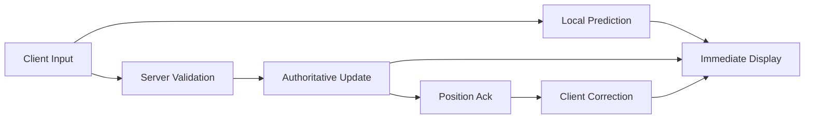

| 目标 | 实现方式 |
|------|----------|
| 低延迟输入 | 客户端本地预测，立即显示 |
| 作弊防护 | 服务器验证移动，权威位置 |
| 平滑体验 | 位置修正使用插值平滑 |
| 网络优化 | 分层通道，高频数据用 unreliable |

### 1.2 核心原则 | Core Principles

1. **服务器权威** (Server Authority)
   - 所有位置最终以服务器为准
   - 客户端预测仅用于本地显示

2. **输入驱动** (Input-Driven)
   - 服务器接收输入而非位置
   - 基于输入计算位移

3. **宽容验证** (Tolerant Validation)
   - 允许合理网络抖动
   - 违规累积阈值机制

---

## 2. 架构分层 | Architecture Layers

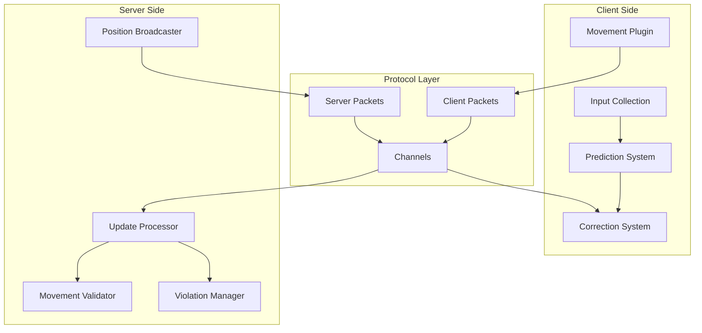

### 2.1 客户端分层 | Client Layers

| 层级 | 模块 | 文件 | 职责 |
|------|------|------|------|
| 输入层 | Input System | `client/src/input.rs` | 收集键盘/鼠标/手柄输入 |
| 逻辑层 | Movement Plugin | `client/src/movement/plugin.rs` | 管理移动配置和系统注册 |
| 预测层 | Prediction | `client/src/movement/prediction.rs` | 本地预测位置计算 |
| 修正层 | Correction | `client/src/movement/correction.rs` | 服务器位置同步 |

### 2.2 服务器分层 | Server Layers

| 层级 | 模块 | 文件 | 职责 |
|------|------|------|------|
| 配置层 | Config | `server/src/movement/config.rs` | 配置参数和违规追踪 |
| 验证层 | Validation | `server/src/movement/validation.rs` | 移动验证算法 |
| 处理层 | Update Processor | `server/src/movement/update.rs` | 输入处理和状态更新 |
| 广播层 | Network | `server/src/network.rs` | 消息广播 |

---

## 3. 数据流设计 | Data Flow Design

### 3.1 正常移动流程 | Normal Movement Flow

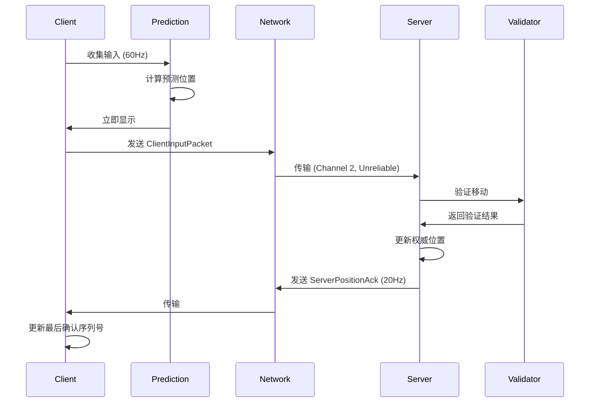

### 3.2 位置修正流程 | Position Correction Flow

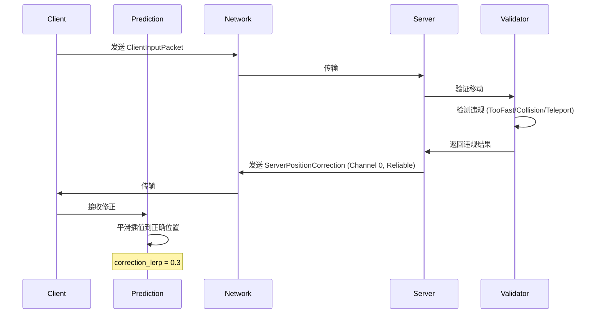

### 3.3 违规处理流程 | Violation Handling Flow

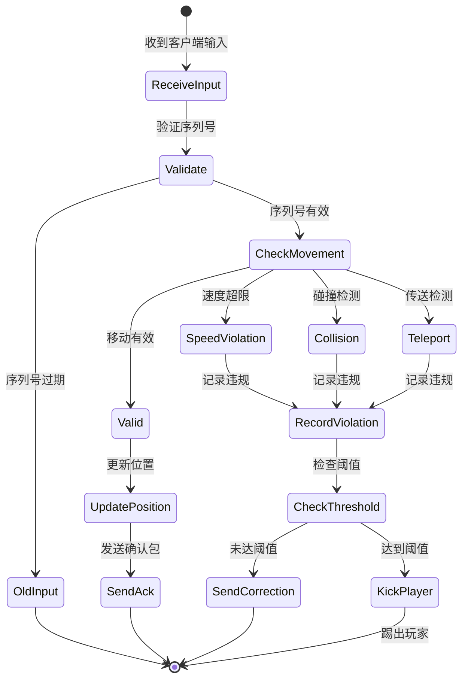

---

## 4. 组件关系图 | Component Relationships

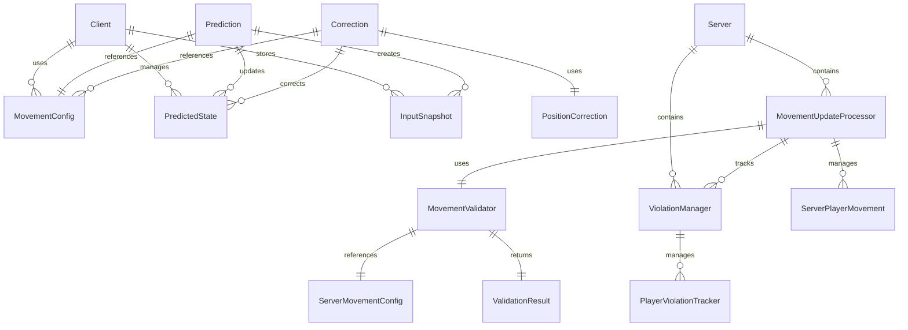

---

## 5. 关键数据结构 | Key Data Structures

### 5.1 客户端数据 | Client Data

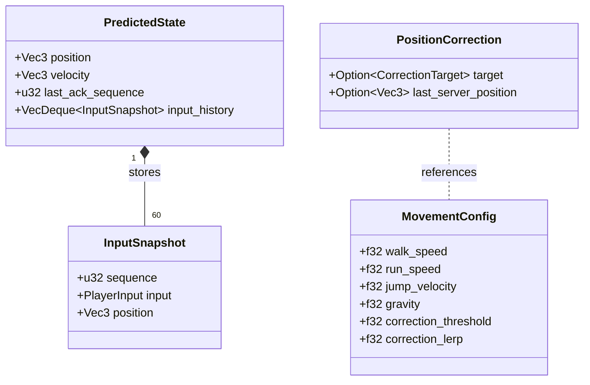

### 5.2 服务器数据 | Server Data

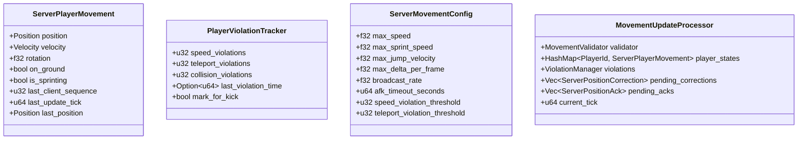

---

## 6. 网络拓扑 | Network Topology

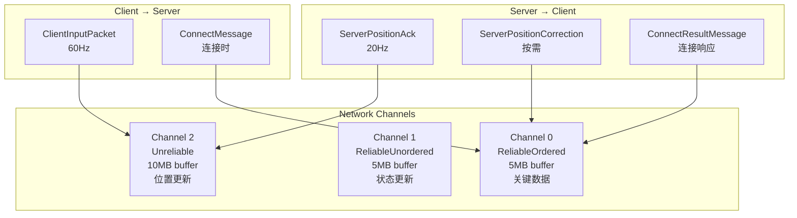

---

## 7. 性能与扩展性 | Performance & Scalability

### 7.1 性能指标 | Performance Metrics

| 指标 | 目标值 | 当前实现 |
|------|--------|----------|
| 客户端输入频率 | 60Hz | ✅ 实现 |
| 服务器 tick rate | 60Hz | ✅ 实现 |
| 位置广播频率 | 20Hz | ✅ 实现 |
| 单服务器玩家数 | 64+ | 可扩展 |
| 输入历史容量 | 60帧 | ✅ 实现 |

### 7.2 网络带宽估算 | Bandwidth Estimation

```
每个玩家每秒带宽（上行）:
ClientInputPacket: ~32 bytes × 60 Hz = 1.92 KB/s

每个玩家每秒带宽（下行）:
ServerPositionAck: ~40 bytes × 20 Hz = 0.8 KB/s
ServerPositionCorrection: ~32 bytes × 按需 = 可变

64玩家服务器总下行:
≈ 64 × 0.8 KB/s = 51.2 KB/s (基础)
+ 其他实体更新 ≈ 100-200 KB/s
```

---

## 8. 安全机制 | Security Mechanisms

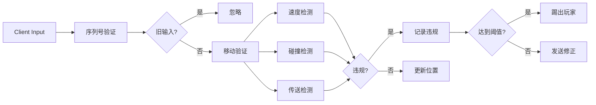

### 安全配置 | Security Configuration

| 参数 | 默认值 | 作用 |
|------|--------|------|
| max_delta_per_frame | 2.0 | 单帧最大位移 |
| speed_violation_threshold | 10 | 速度违规阈值 |
| teleport_violation_threshold | 3 | 传送违规阈值（踢出） |

---

## 9. 文件组织 | File Organization

```
trueworld/
├── crates/
│   ├── protocol/src/
│   │   ├── client.rs          # ClientInputPacket, ClientInput
│   │   ├── server.rs          # ServerPositionAck, ServerPositionCorrection
│   │   └── lib.rs             # Channel configuration
│   │
│   ├── core/src/
│   │   ├── types.rs            # PlayerInput, InputAction
│   │   └── math.rs             # Vec3, Quat (glam re-exports)
│   │
│   ├── client/src/
│   │   └── movement/
│   │       ├── mod.rs           # Module exports
│   │       ├── plugin.rs        # MovementConfig, ClientMovementPlugin
│   │       ├── prediction.rs    # PredictedState, predict_movement
│   │       └── correction.rs    # PositionCorrection, correct_position
│   │
│   └── server/src/
│       └── movement/
│           ├── mod.rs           # Module exports
│           ├── config.rs        # ServerMovementConfig, ViolationManager
│           ├── validation.rs    # ValidationResult, MovementValidator
│           └── update.rs        # MovementUpdateProcessor, ProcessInputResult
│
└── docs/
    ├── architecture/
    │   └── movement-system.md   # 本文档
    ├── prd/
    │   └── movement-system.md   # 产品规格书
    └── api/
        └── movement-protocol.md  # 接口文档
```

---

## 10. 未来扩展 | Future Extensions

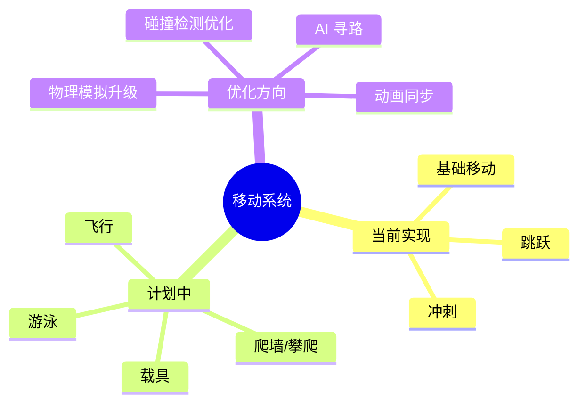

---

**文档版本**: 1.0
**最后更新**: 2026-03-02
